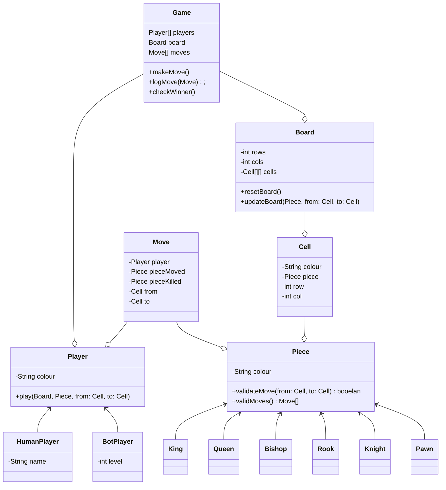

# chess
LLD-practice problem
## Design Chess

### Class Diagram

```mermaid
classDiagram
class Game {
    Player[] players
    Board board
    Move[] moves
    +makeMove()
    +logMove(Move);
    +checkWinner()
}

class Player {
    -String colour
    +play(Board, Piece, from: Cell, to: Cell)
}

class HumanPlayer {
    -String name
}

class BotPlayer {
    -int level
}

%% resetBoard
%% updateBoard - after the Piece moved by a Player
class Board {
    -int rows
    -int cols
    -Cell[][] cells
    +resetBoard()
    +updateBoard(Piece, from: Cell, to: Cell)
}

%% how to show empty cells?
class Cell {
    -String colour
    -Piece piece
    -int row
    -int col
}

%% there might be a piece getting killed in a move. We need to show the killed Piece also
class Move {
    -Player player
    -Piece pieceMoved
    -Piece pieceKilled
    -Cell from
    -Cell to
}

%% How to show how different pieces move
%% steps and directions
%% Piece will move from one cell to other cell, one move among many possible valid moves
class Piece {
    -String colour
    +validateMove(from: Cell, to: Cell) booelan
    +validMoves() Move[]
    
}

class King {
    
}

class Queen {
    
}

class Bishop {
    
}

class Rook {
    
}

class Knight {
    
}

class Pawn {
    
}

Game --o Player
Game --o Board

Player <-- HumanPlayer
Player <-- BotPlayer

Board --o Cell

Cell --o Piece

Move --o Player
Move --o Piece

Piece <-- King
Piece <-- Queen
Piece <-- Bishop
Piece <-- Rook
Piece <-- Knight
Piece <-- Pawn
```
